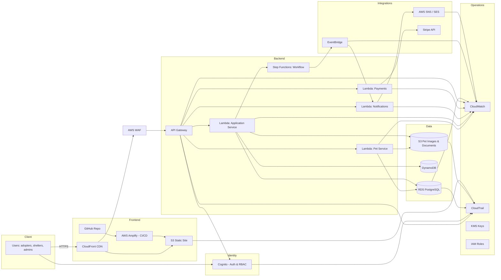

# Pet Adoption Platform - Backend

**Created by:** Nikola Stoleru  
**Project:** CSC1057 IT Architectures Group A.A.T.R.N  
**Part:** Person 3 - Backend Development

## Overview

This backend provides sample data for the Pet Adoption Platform frontend. It includes:
- **15 sample pets** (dogs and cats with different breeds, ages, and statuses)
- **3 shelter locations** across Ireland
- **5 adoption applications** showing the adoption workflow

## Files Included

- `pets.json` - Database of 15 adoptable pets
- `shelters.json` - Information about 3 animal shelters
- `adoptions.json` - Sample adoption application records
- `api.py` - Simple REST API built with Flask
- `README.md` - This file

## How to Run the API

### Requirements
- Python 3.8 or higher
- Flask library

### Installation Steps

1. **Install Python** (if not already installed)
   - Download from: https://www.python.org/downloads/
   - Make sure to check "Add Python to PATH" during installation

2. **Install Flask**
```bash
   pip install flask flask-cors
```

3. **Run the API**
```bash
   python api.py
```

4. **Open your browser and go to:**
```
   http://localhost:5000
```

## API Endpoints

| Endpoint | Method | Description | Example |
|----------|--------|-------------|---------|
| `/` | GET | API home page | `http://localhost:5000` |
| `/api/pets` | GET | Get all pets | `http://localhost:5000/api/pets` |
| `/api/pets/:id` | GET | Get specific pet | `http://localhost:5000/api/pets/1` |
| `/api/pets/species/:species` | GET | Filter by species | `http://localhost:5000/api/pets/species/dog` |
| `/api/pets/status/:status` | GET | Filter by status | `http://localhost:5000/api/pets/status/available` |
| `/api/shelters` | GET | Get all shelters | `http://localhost:5000/api/shelters` |
| `/api/shelters/:id` | GET | Get specific shelter | `http://localhost:5000/api/shelters/1` |
| `/api/adoptions` | GET | Get all adoptions | `http://localhost:5000/api/adoptions` |

## Sample API Response

### Get All Pets
**Request:** `GET /api/pets`

**Response:**
```json
[
  {
    "id": 1,
    "name": "Buddy",
    "species": "Dog",
    "breed": "Golden Retriever",
    "age": 3,
    "status": "Available",
    "shelter_id": 1,
    "image": "https://images.unsplash.com/photo-1633722715463-d30f4f325e24?w=500",
    "description": "Buddy is a friendly and energetic Golden Retriever...",
    "adoption_fee": 200
  },
  ...
]
```

## Data Structure

### Pet Object
```json
{
  "id": 1,
  "name": "string",
  "species": "Dog|Cat",
  "breed": "string",
  "age": number,
  "gender": "Male|Female",
  "size": "Small|Medium|Large",
  "status": "Available|Adopted|Pending",
  "shelter_id": number,
  "image": "string (URL)",
  "description": "string",
  "vaccinated": boolean,
  "spayed_neutered": boolean,
  "adoption_fee": number
}
```

### Shelter Object
```json
{
  "id": 1,
  "name": "string",
  "location": "string",
  "address": "string",
  "phone": "string",
  "email": "string",
  "website": "string",
  "opening_hours": "string"
}
```

### Adoption Object
```json
{
  "id": 1,
  "pet_id": number,
  "pet_name": "string",
  "adopter_name": "string",
  "adopter_email": "string",
  "adopter_phone": "string",
  "status": "Pending|In Review|Completed",
  "application_date": "YYYY-MM-DD",
  "adoption_date": "YYYY-MM-DD or null"
}
```
## Cloud Architecture


## How the Frontend Uses This

The frontend (Person 4) can:
1. Fetch all pets and display them in a gallery
2. Filter pets by species (show only dogs or only cats)
3. Show pet details when user clicks on a pet
4. Display shelter information
5. Show adoption application status

## Testing

To test if the API is working:

1. Start the API: `python api.py`
2. Open browser
3. Try each endpoint listed above
4. You should see JSON data returned

## Notes for Team

- All pet images are from Unsplash (free stock photos)
- Pet data is realistic and matches Ireland's common breeds
- Adoption fees are in EUR and realistic for Ireland
- The API uses CORS so the frontend can access it
- Status values: "Available", "Adopted", or "Pending"

## Future Enhancements

For a production system, this would connect to a real database (like PostgreSQL on AWS RDS) instead of JSON files. The API structure would remain the same, but data would persist and be editable.

## Contact

**Nikola Stoleru**  
nikola.stoleru2@mail.dcu.ie  
Student Number: 37342
